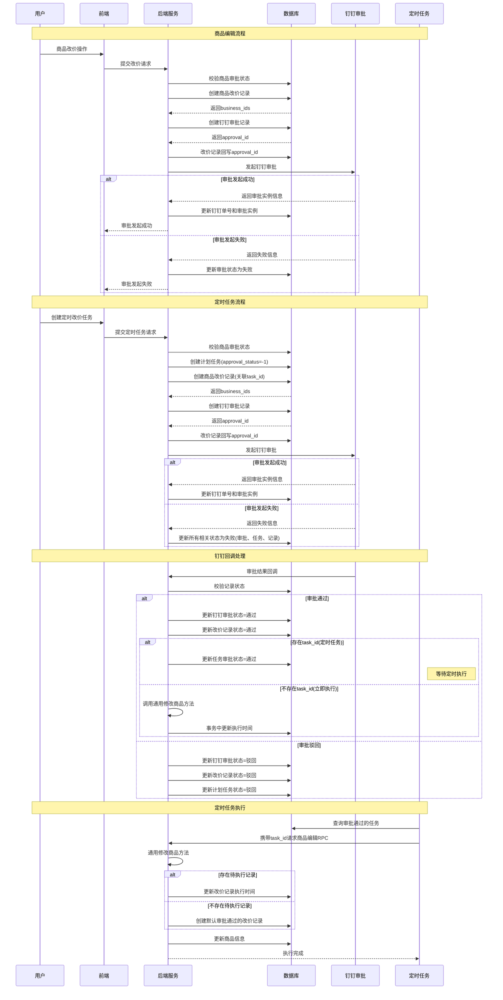
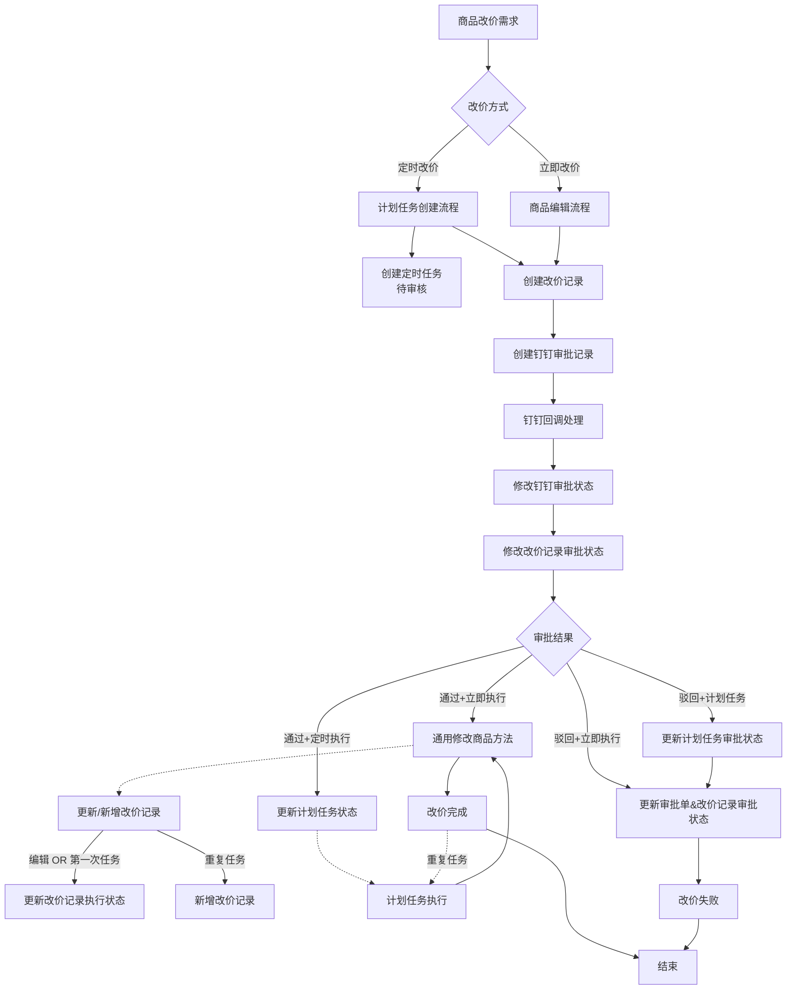
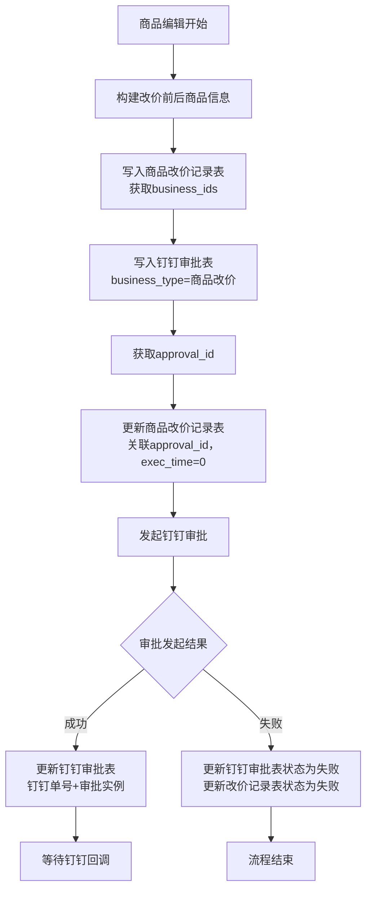
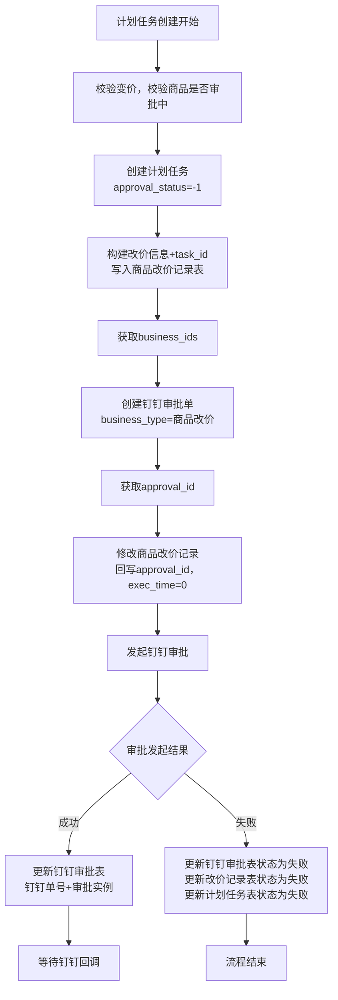
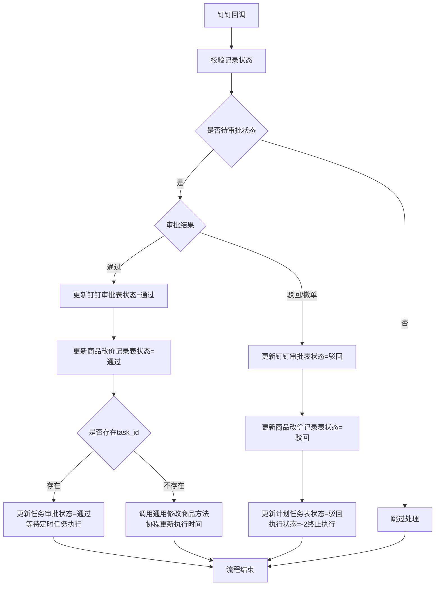
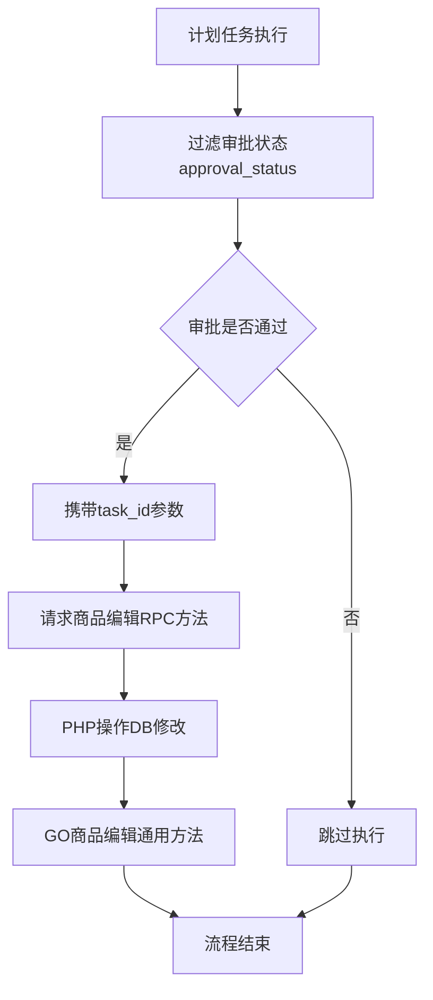
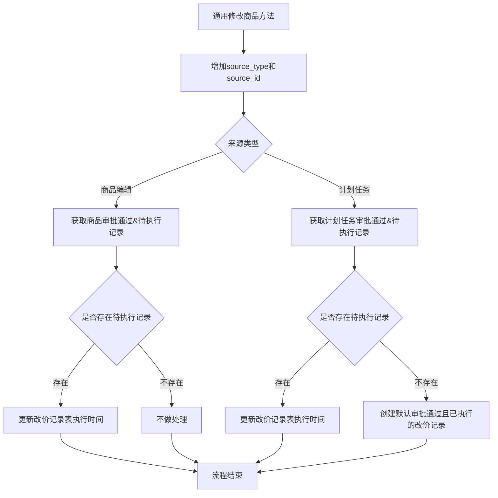
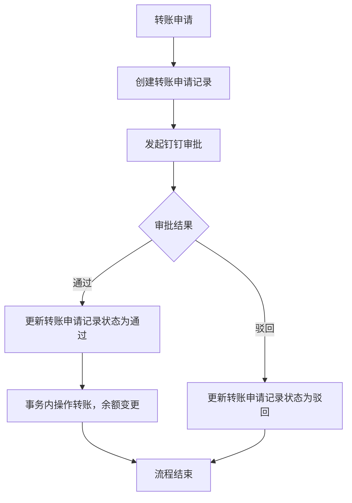

# 钉钉审批通用化方案

##

### 表设计

- 上游平台钉钉审批表

```sql
-- 钉钉审批表
CREATE TABLE `dingtalk_approval` (
   `id` int(11) unsigned NOT NULL AUTO_INCREMENT,
   `business_type` tinyint(4) NOT NULL COMMENT '业务类型 1.上游平台商品改价',
   `business_id` json NOT NULL COMMENT '业务ids jsonArray',
   `data` text NOT NULL COMMENT '审批数据 json',
   `data_extend` text NOT NULL COMMENT '审批扩展数据 json',
   `creator` int(11) NOT NULL COMMENT '创建人id',
   `status` tinyint(4) NOT NULL COMMENT '审批状态 1.待审批 2.驳回 3.通过',
   `dingtalk_instance_id` varchar(64) COLLATE utf8mb4_unicode_ci NOT NULL COMMENT '钉钉审批实例id',
   `dingtalk_sn` varchar(32) COLLATE utf8mb4_unicode_ci NOT NULL COMMENT '钉钉审批单号',
   `create_time` int(11) NOT NULL COMMENT '创建时间',
   `update_time` int(11) NOT NULL COMMENT '更新时间',
   PRIMARY KEY (`id`) USING BTREE
) ENGINE=InnoDB COMMENT='上游商品改价审批表|20250710|fzy';
```

- 业务审批记录表(审批产生的数据)

```sql
-- 商品改价记录表
CREATE TABLE `platform_product_price_log` (
   `id` int(11) unsigned NOT NULL AUTO_INCREMENT,
   `product_id` int(11) NOT NULL COMMENT '商品id',
   `price_original` decimal(12,4) NOT NULL COMMENT '购买价原价 platform_product.price',
   `price_updated` decimal(12,4) NOT NULL COMMENT '购买价格修改价',
   `discount_original` decimal(6,4) NOT NULL COMMENT '原折扣 platform_product.discount',
   `discount_updated` decimal(6,4) NOT NULL COMMENT '修改后折扣',
   `purchase_price_original` decimal(12,4) NOT NULL COMMENT '采购价原价 platform_product.purchase_price',
   `purchase_price_updated` decimal(12,4) NOT NULL COMMENT '采购价修改价',
   `task_id` int(11) NOT NULL COMMENT '计划任务id',
   `exec_time` int(11) NOT NULL COMMENT '执行时间',
   `approval_id` int(11) NOT NULL COMMENT '审批id dingtalk_approval.id',
   `status` tinyint(4) NOT NULL COMMENT '审批状态 1.待审核 2.驳回 3.通过 11.执行成功 12.执行失败',
   `create_time` int(11) NOT NULL COMMENT '创建时间',
   `update_time` int(11) NOT NULL COMMENT '更新时间',
   PRIMARY KEY (`id`) USING BTREE,
   KEY `idx_product_id_approval_status` (`product_id`, `approval_status`) USING BTREE
) ENGINE=InnoDB COMMENT='上游商品改价记录表|20250710|fzy';

-- 上游计划任务表
ALTER TABLE `crontab_supplier`
ADD COLUMN `approval_status` tinyint(4) NOT NULL DEFAULT 0 COMMENT '改价审批状态 0.通过 1.待审核 2.驳回';
```

### 基本流程

#### 商品改价

- 整体时序图



- 整体流程概览



- 商品编辑

1. 构建改价前后商品信息，写商品改价记录表，获取业务ids`business_ids`
2. 写上游平台钉钉审批表，业务类型`business_type`为`商品改价`，获取审批id`approval_id`
3. 写商品改价记录表，使用审批id`approval_id`关联；执行时间`exec_time`为0
4. 发起钉钉审批
   1. 成功：修改钉钉审批表`钉钉单号``审批实例`
   2. 失败：修改钉钉审批表`审批状态`为失败；修改商品改价记录表`审批状态`为失败



- 计划任务创建

1. 校验变价，校验商品是否审批中
2. 创建计划任务，状态为待审核`approval_status = -1`
3. 构建改价前后商品信息，附加任务id`task_id`参数，写商品改价记录表，使用计划任务id`task_id`关联，返回`business_ids`
4. 创建审批单，业务类型`business_type`依旧为`商品改价`，获取审批id`approval_id`
5. 修改商品改价记录，回写审批id`approval_id`；执行时间`exec_time`为0
6. 发起钉钉审批
   1. 成功：修改钉钉审批表`钉钉单号``审批实例`
   2. 失败：
      1. 修改钉钉审批表`审批状态`为失败；修改商品改价记录表`审批状态`为失败
      2. 修改计划任务表`审批状态`为失败



- 计划任务执行 - 审批前

1. 增加审批状态字段`approval_status`过滤

- 钉钉回调

1. 校验记录状态等，如：非待审批跳过
2. 校验审批结果
   1. 审批通过：
      1. 修改钉钉审批表记录`审批状态`为`通过`
      2. 修改商品改价记录表`审批状态`为`通过`；执行时间`exec_time`不变，依旧为0
      3. 判断商品改价记录是否存在任务id`task_id > 0`
         1. 存在
            1. 修改商品改价记录表关联的任务`审批状态`为`通过`
            2. 等待定时任务执行
         2. 不存在
            1. 通用修改上游平台商品方法[已存在的独立方法]；方法中事务更新商品改价记录表`执行时间`
      4. 修改商品改价记录表关联的任务`审批状态`为`通过`
   2. 审批驳回/撤单：修改商品改价记录表`审批状态`为`驳回`
      1. 修改钉钉审批表记录`审批状态`为`驳回`
      2. 修改商品改价记录表关联的任务`审批状态`为`驳回`
      3. 修改计划任务表关联的任务`审批状态`为`驳回`，执行状态为`-2：终止执行`



- 计划任务执行 - 审批后

1. 携带任务id`tak_id`参数，请求商品编辑RPC方法
2. PHP操作DB修改 -> GO商品编辑通用方法 [重点关注]



- 通用修改上游平台商品方法
  
1. 增加修改来源类型`source_type`和来源id`source_id`
2. 增加协程更新商品改价记录表方法
   1. 来源类型为`商品编辑`
      1. 获取当前商品在商品改价记录表的`审批通过&待执行`记录
         1. 存在`待执行`记录：更新改价记录表记录的`执行时间`
         2. 不存在`待执行`记录：不做处理
   2. 来源类型为`计划任务`且任务id存在`source_id > 0`
      1. 获取当前计划任务在商品改价记录表的`审批通过&待执行`记录
         1. 存在`待执行`记录：更新改价记录表记录的`执行时间`
         2. 不存在`待执行`记录：创建一批默认审批通过且已执行的`改价记录`；关联传入的任务id



- 疑问

> Q: 为什么考虑这样设计，比起单业务审批记录表的优势在哪里？
> A: <br>1. 扩展性：目前的单业务审批表模式是因为审批单-业务记录一对一，所以单表更为适合，后续若出现一对多的场景，单表模式会变得不适用 <br>2. 收敛：平台上的所有钉钉审批都有一个归拢的地方，后续可看情况设计为策略模式 <br>3. 便利性：业务变更记录仅存储业务需要的数据即可，不再存储关联的审批附件等信息
>
> Q: 为什么要在业务表冗余审批单号？
> A: <br>1. 溯源：虽然通过业务id可以溯源到审批单，但是sql较为麻烦 <br>2. 列表易筛选：通常业务审批记录都需要看到审批单号，无论是展示审批发起信息和列表筛选联查，都容易很多
>
> Q: 计划任务状态改为终止执行是否必要？
> A: 无需，筛选条件加入审批状态，速度慢了后加索引

### 当前钉钉审批业务现状

|业务|逻辑实现|备注|
|--|--|--|
| 合同下载申请 | resource_download | 仅存储业务数据，不存储钉钉审批相关。发送钉钉审批时，关联业务外部关联id，回调时处理 |
| 审批卡密订单 | - | 未找到 |
| 审批授权商品价格 | - | 未找到 |
| 审批采购订单 | - | 未找到 |
| 结算单审批 | settlement_statement | 存储业务数据+钉钉审批单号 |
| 结算单审批(new) | - | 未找到 |
| 发票审批 | invoice | 存储业务数据+钉钉审批单号 |
| 上游结算单审批 | - | 未找到 |
| 上游结算单审批(卡密) | - | 未找到 |
| 付款单审批 | payment_order | 存储业务数据+钉钉审批单号 |
| 审批调拨单 | - | 未找到 |
| 财务管理: 汇款审批 | recharge | 存储业务数据+钉钉审批信息 |
| 直连天下的上游售后审批 | - | 未找到 |
| 直连天下的下游售后审批 | - | 未找到 |
| 直连天下-增加授信 | grant_credit_log | 存储业务数据+钉钉审批信息 |
| 财务管理: 转账审批 | transfer_log | 存储业务数据+钉钉审批信息 |
| ORDER_SUPPLEMENT | - | 进行中 |
| 上游商品改价审批 | - | 进行中 |
| 下游售后审批(卡密) | - | 进行中 |
| 上游售后审批(卡密) | - | 进行中 |

#### 案例

1. 转账申请 - 单表存储业务数据+钉钉审批信息

- 转账申请总流程



- 转账申请表依赖

```sql
-- 转账记录表`transfer_log`
CREATE TABLE `transfer_log` (
  `id` int(11) unsigned NOT NULL AUTO_INCREMENT,
  `recharge_reseller_id` int(11) NOT NULL COMMENT '加款下游',
  `deduction_reseller_id` int(11) NOT NULL COMMENT '扣款下游',
  `transfer_money` decimal(12,4) NOT NULL COMMENT '转账金额',
  `remark` text COLLATE utf8mb4_unicode_ci NOT NULL COMMENT '备注',
  `enter_man` int(11) NOT NULL COMMENT '录入人id',
  `status` tinyint(4) NOT NULL COMMENT '状态 0.待审核 -1.驳回 1.通过',
  `dingtalk_instance_id` varchar(64) COLLATE utf8mb4_unicode_ci NOT NULL COMMENT '钉钉审批实例id',
  `dingtalk_sn` varchar(32) COLLATE utf8mb4_unicode_ci NOT NULL COMMENT '钉钉审批单号',
  `create_time` int(11) NOT NULL COMMENT '创建时间',
  `update_time` int(11) NOT NULL COMMENT '更新时间',
  PRIMARY KEY (`id`) USING BTREE,
  KEY `idx_deduction_reseller_id` (`deduction_reseller_id`) USING BTREE,
  KEY `idx_recharge_reseller_id` (`recharge_reseller_id`) USING BTREE,
  KEY `idx_status` (`status`) USING BTREE
) ENGINE=InnoDB AUTO_INCREMENT=35 DEFAULT CHARSET=utf8mb4 COLLATE=utf8mb4_unicode_ci COMMENT='转账记录表|20250704|fzy';
```

**原设计方案**
    创建转账记录表记录转账记录[类比上面的业务审批记录表]，由于记录与钉钉审批`1对1`，所以直接用一张表实现，与钉钉审批相关字段放在一起
**后续迁移方案**
    将业务记录表拆分为两张表钉钉审核表`platform_dingtalk_approval` 和 业务审核表`transfer_log`，业务记录表增加`审批id`、`审批状态`。存在两个好处：
    1. 钉钉审批与业务记录可一对多
    2. 上游/下游的钉钉审批记录被归拢

2. 合同下载申请 - 不存储钉钉相关，将业务记录id作为外部关联id回调使用

```sql
CREATE TABLE `resource_download` (
  `id` int(11) NOT NULL AUTO_INCREMENT,
  `user_id` int(11) NOT NULL DEFAULT '0' COMMENT '用户id',
  `type` tinyint(2) NOT NULL DEFAULT '0' COMMENT '类型,1-合同',
  `name` varchar(64) COLLATE utf8mb4_unicode_ci NOT NULL DEFAULT '' COMMENT '资源名称',
  `type_out_id` int(11) NOT NULL DEFAULT '0' COMMENT '关联的外部 id,合同类型-contract.id',
  `url` varchar(1000) COLLATE utf8mb4_unicode_ci NOT NULL DEFAULT '' COMMENT '私有链接',
  `download_url` varchar(1000) COLLATE utf8mb4_unicode_ci NOT NULL DEFAULT '' COMMENT '下载链接',
  `end_time` int(11) NOT NULL DEFAULT '0' COMMENT '下载链接失效时间',
  `create_time` int(11) NOT NULL DEFAULT '0' COMMENT '创建时间',
  `update_time` int(11) NOT NULL DEFAULT '0' COMMENT '更新时间',
  `status` tinyint(2) NOT NULL DEFAULT '0' COMMENT '状态，-1-已删除，0-终止，1-审批中，2-审批通过，3-生成中，4-已生成',
  PRIMARY KEY (`id`) USING BTREE,
  KEY `idx_user` (`user_id`),
  KEY `idx_type` (`type`,`type_out_id`)
) ENGINE=InnoDB AUTO_INCREMENT=32 DEFAULT CHARSET=utf8mb4 COLLATE=utf8mb4_unicode_ci COMMENT='资源下载表';
```

3. 付款单审批 - 存储业务数据+钉钉审批单号

```sql
CREATE TABLE `payment_order` (
  `id` int(11) unsigned NOT NULL AUTO_INCREMENT,
  `created_at` datetime NOT NULL DEFAULT CURRENT_TIMESTAMP,
  `updated_at` datetime NOT NULL DEFAULT CURRENT_TIMESTAMP ON UPDATE CURRENT_TIMESTAMP,
  `deleted_at` bigint(20) NOT NULL DEFAULT '0',
  `remark` varchar(255) NOT NULL DEFAULT '' COMMENT '备注信息',
  `status` tinyint(1) NOT NULL DEFAULT '1' COMMENT '状态',
  `supplier_id` int(11) unsigned NOT NULL COMMENT '上游ID',
  `tag` int(10) NOT NULL COMMENT '所属系统',
  `supplier_name` varchar(255) NOT NULL DEFAULT '' COMMENT '上游名称',
  `amount` int(11) NOT NULL COMMENT '付款总金额',
  `subject_id` int(11) unsigned NOT NULL COMMENT '主体信息',
  `subject_name` varchar(255) NOT NULL DEFAULT '' COMMENT '主体名称',
  `credited_account` varchar(255) NOT NULL DEFAULT '' COMMENT '收款账户',
  `subject_account` varchar(255) NOT NULL DEFAULT '' COMMENT '企业付款账户',
  `finish_at` datetime DEFAULT NULL COMMENT '单据完成时间',
  `approval_no` varchar(255) NOT NULL DEFAULT '' COMMENT '审批单号',
  `user_id` int(11) NOT NULL COMMENT '创建人',
  `username` varchar(255) NOT NULL DEFAULT '' COMMENT '创建人名称',
  `detail_info` text NOT NULL COMMENT '付款明细数组json',
  `approval_remark` text NOT NULL COMMENT '审批备注',
  `buss_id` varchar(255) NOT NULL DEFAULT '' COMMENT '审批业务单号',
  `approval_row` text NOT NULL COMMENT '审批回调参数',
  `credited_bank` text NOT NULL COMMENT '对方收款账户银行明细',
  `pay_req` text NOT NULL COMMENT '支付信息',
  `pay_reply` text NOT NULL COMMENT '支付响应',
  `err` text NOT NULL COMMENT '支付错误原因',
  `subject_bank` text NOT NULL COMMENT '付款账户银行明细',
  `subject_info` text NOT NULL COMMENT '付款账户银行明细',
  `purpose` varchar(255) NOT NULL DEFAULT '' COMMENT '用途（回单备注）',
  `summary` varchar(255) NOT NULL DEFAULT '' COMMENT '附言',
  `supplier_bank` varchar(255) NOT NULL DEFAULT '{}' COMMENT '上游账户银行明细',
  `receipt_status` tinyint(2) NOT NULL DEFAULT '0' COMMENT '回单状态， 1: 以回单， 0: 未回单',
  `receipt_file` varchar(255) NOT NULL DEFAULT '' COMMENT '回单文件下载地址',
  PRIMARY KEY (`id`)
) ENGINE=InnoDB AUTO_INCREMENT=119 DEFAULT CHARSET=utf8 COMMENT='付款单模块';
```

### 迁移方案

1. 稳定性：现有钉钉审批流程不变，依旧使用单业务审批记录表的形式
2. 扩展性：后续有钉钉审批与业务1对1的场景，可以使用当前方案，保证扩展性
